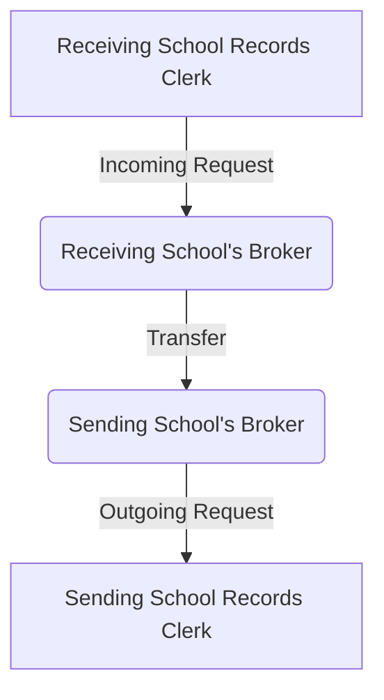

# Broker Concepts
Different vocabulary can be used to describe the same concepts that the Broker uses.

## Vocabulary
* *Receiving School*. When a parent registers their student at a new school, this school will become the receiving school. It may also be called the enrolling school, the receiving school or the requesting school.
* *Sending School*. This is the student's previous school and the one that will send records to the receiving school. It may also be called the releasing school.
* *Records Clerk*. The person that processes student records. Adding *receiving* or *sending* in front of *records clerk* designates which school's records clerks is being referred.
* *Incoming Request*. The receiving records clerk generates an incoming request in their broker, entering the information necessary to generate the  
* *Outgoing Request*. When the new school generates the incoming request, the receiving school's broker sends that request to the sending school's broker. That request appears for the sending school as an outgoing request.

## High-Level Flow Steps
1. New student registered at receiving school.
2. Receiving records clerk creates an incoming request in their broker.
3. Receiving school's broker transfers request to sending school's broker.
4. Sending school's records clerk processes outgoing request.
5. Sending school's broker prepares records payload, and transfers it to receiving school's broker.
6. Receiving school's records clerk processes payload attached to incoming request.

## High-Level Flow Diagram

## Business Process Rules
1. The receiving school always starts the process and initiates the request. The records are pulled to the new school - not pushed. The sending school will never start the request.
