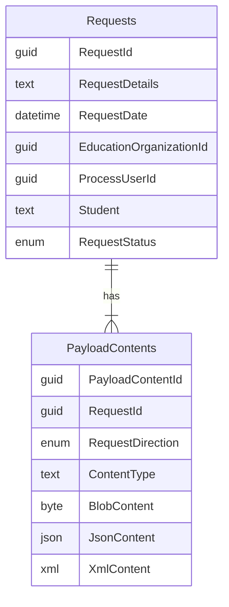

# Incoming Requests
These are the requests the receiving school is making.

## Data Model



## Example Record Upon Record Submission
This is the `Request` record state upon incoming records clerk's submission.
```json
{
    "RequestId": "fd60c580-aaa5-4319-9aba-9362cfee29ec",
    "RequestDetails": null,
    "RequestDate": "2023-09-11 05:03:20.462908+00",
    "EducationOrganizationId": "aba6d628-257d-4444-810f-2a9509161434",
    "ProcessUserId": "5b97e5a2-b39e-48b5-9dd3-97ef855bea22",
    "Student": {
        "OregonNexus.Broker.Connector.EdFiAlliance.EdFi.Student": {
            "id": "000000",
            "studentUniqueId": "0000000",
            "firstName": "John",
            "middleName": "T",
            "lastSurname": "Doe"
        }
    },
    "RequestStatus": 3
}
```

## Persistence
* Incoming requests are persisted in the `IncomingRequests` table.
* Their counterpart in the sending school's broker are persisted in the `OutgoingRequests` table.

From the perspective of the broker itself, records in the IncomingRequests table represent new students coming in and records in the OutgoingRequests table represent students that are leaving it.

When the receiving records clerk makes the initial incoming request, that record is persisted in IncomingRequests. After the receiving school's broker transmits the request to the sending school's broker, the sending schoo's broker will persist the request in OutgoingRequests.
