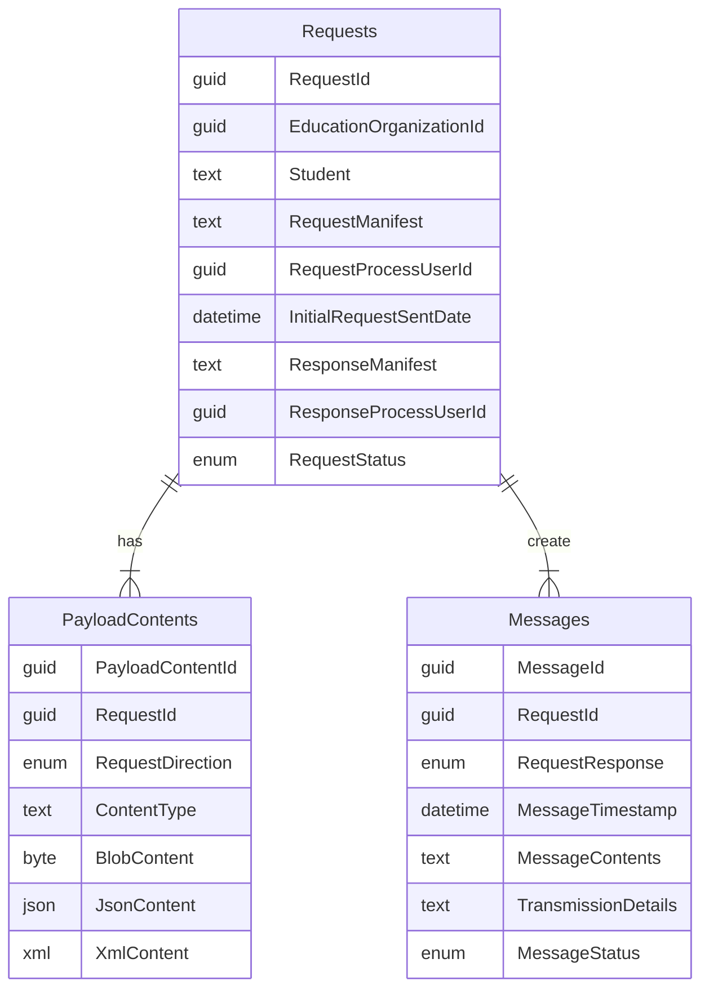

# Requests
Incoming and outgoing requests are persisted in the same tables.

## Data Model

```mermaid
erDiagram
    Requests ||--|{ PayloadContents : has
    Requests {
        guid RequestId
        guid EducationOrganizationId
        text Student
        text RequestManifest
        guid RequestProcessUserId
        datetime InitialRequestSentDate
        text ResponseManifest
        guid ResponseProcessUserId
        enum RequestStatus
    }
    Requests ||--|{ Messages : create
    Messages {
    	guid MessageId
    	guid RequestId
    	enum RequestResponse
    	datetime MessageTimestamp
    	text MessageContents
    	text TransmissionDetails
    	enum MessageStatus
    }
    PayloadContents {
        guid PayloadContentId
        guid RequestId
        enum RequestDirection
        text ContentType
        byte BlobContent
        json JsonContent
        xml XmlContent
    }
```
